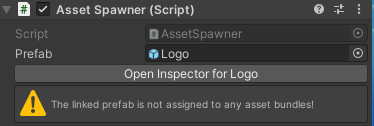

# Asset Bundle Manager

This demo project demonstrates an asset loading system which has the following features.

* Enables designers to drag/drop a prefab from the project view into the spawner component to instantiate a GameObject at runtime.
* Designers can move, rename prefabs, or modify asset bundles without impacting functionality.
* Custom Inspector alerts designers of misconfigured prefabs and provides automatic fixes.
* Incorporates a asset bundle manager to oversee the loading and unloading of asset bundles.
* Offers future flexibilty to change the methods of asset bundle loading (local, remote, simulated)

## Usage

- Unity 2022.3.5f1

### Demo Scene

The scene `SpawnTestScene` is provided to demonstrate usage of the asset management system. 

### Setup for New Objects

#### Assigning Prefab to Spawn
1. Create Spawner
    - Place an `AssetSpawn` prefab in the scene. 
    - Located in Assets/Prefabs/Spawners

2. Select Prefab to Spawn
    - Drag and Drop a prefab onto the AssetSpawn's prefab field within the inspector.
    - Alternatively, use the object picker in the AssetSpawn's Prefab field.
    

3. Missing Component Prompt. 
    - If the prefab lacks a unique id, a prompt will offer to add the component. Select OK. Then re-select the prefab. The prefab should now integrate the `PrefabUniqueIdentifier` component.

        

4. Select Asset Bundle
    - If the prefab isn't a part of any asset bundle, the AssetSpawner inspector will notify with an error in AssetSpawn inspector. Assign an asset bundle via the Prefab's Inspector at the bottom of it's inspector.

        

5. Build Asset Bundles 
    - Right-click in the Project View and select `Build Asset Bundles and Manifest` from the context menu.

        

6. Run Scene
    - The prefab should instantiate using the AssetSpawner's transform as a child of the AssetSpawner.

        

#### Build Setup (Already done for you)

- The configuration file detailing builds and path definitions is located in Assets/Resources/Settings/LocalConfig.asset
- Project can be built and run on Windows

#### Testing Asset Bundles Changes in a Build (optional)

- Feel free to change prefabs and update asset bundles locally. (Sorry, windows only for this demo)
- Asset Bundles can be rebuilt and copy into the built project folder. 
- After building asset bundles they are located in Assets/AssetBundles
- Copy the contents of this folder to your build directory's [name]_Data/AssetBundles directory. 
- Run the game and the new changes to prefabs should be loaded. 

## Discussion

This project allows the designer to change prefab locations, rename the prefab, and change the asset bundles without breaking references. The project can be expanded in several areas. 

The loading of assets without breaking references is accomplished by the use of a prefab unique id component. The AssetSpawn class and the AssetBundleManager use this id to load the prefab regardless of path, name change, or bundle change. This serves to solve a previous issue using Unity's own guids in the past. Further investigation may allow the project to forgo the prefab unique id component and rely on the guid Unity generates. However, Unity's guid isn't 100% guarenteed and has caused issues in the past. 

The AssetSpawn class meets the requirements of having the Start() function instanciate a prefab. An alternative solution would be to allow the designer to use events to determine when the object should be instantiated though this was outside the scope of this project. This class could also be expanded to allow for a list of prefabs to be loaded in place of just one. 

The AssetBundleManager in conjunction with the LocalConfig file to provide multiple types of asset managment solutions without code changes. One such solution for this project is providing local asset management.

The LocalAssetBundleManager class loads Asset Bundles on demand using a manifest file. This manifest file allows the loader to reverse lookup which asset bundle the asset is stored. Several optimization could be implemented as the current implementation loads all assets from the bundle then searches for the prefab component id to load. While this solution works for a small project, further development should be considered to improve performance when loading a large amount of assets from a bundle. The manifest itself contains several additional pieces of information which can be used to optimize loading.

The project requires that any change to prefabs to be spawned needs an asset bundle build for the changes to show in the scene. A work around for this is to simulate asset bundles with a different asset bundle loader. This workflow would work well for artists and designers who are working within the project without needing to rebuild at every step. Though this is outside the scope of this demo. 

## Conclusion

This system abstracts away the complexities of working directly with asset bundles and the need to worry about the underlying structure of the project. It is designed to work with the familiar Unity workflow making using asset bundles easy and streamlined. This system could be expanded to provide additional functionality such as loading from remote bundles or simulating asset bundles in the editor. 

### Assumptions 

Several assumptions made during the design of this system should be discussed. 
- The project only needs to demonstrate loading from asset bundles and loading only from local bundles is acceptable. Future flexibility was put in place to accomodate loading bundles from other sources. 
- The designer has little knowledge of the underlying asset bundles and only needs to interact with it at a minimum. Effort was put into the UX/UI experience for the designer to ensure that they have a seemless experience within Unity without needing to learn a new way of working. Any assumption of knowledge to make the system work was put into checks to ensure the prefabs were correctly setup to work.
- Assuming the designers limited knowledge of bundles, not only do path changes need to be accounted for, but any change such as naming, path, or asset bundle changes. 
- Building asset bundles each time a change is made is tedious. For this project the assumption was that workflow is acceptable as this is a demonstration of an asset loading system. Future flexibility is in place to simulate asset bundles to prevent rebuilding each time a change is made. 
- The prefab unique id component solves an issue with Unity's own guid  for game objects. This serializes a random guid and is less likely to change though unity upgrades or other issues with guids changing. The chance of collision is very low but a system could be put in place to check if build issues are encountered. With further investigation and understanding of Unity's guid system we may be able to forgo this custom component on each prefab. 
- Performance of loading asset bundles should have minimal impact is the bundles are created in a thoughtful process. Issues may arise if large numbers of assets are packed into only one bundle. In that case an alternative method of loading asset bundles could be employed which does not load the entire bundle but uses a lookup to load individual assets (with dependencies). 

### Additional Features for Future Work
- Asset Bundle Browser
    - Allow engineers or designers to easily see and configure which objects are bundled together. Currently each prefab needs to be viewed and configured seperately. 
- Simulate Asset Bundles
    - Instead of building and loading each time, the system should allow the use of in project prefabs to be loaded without needing to load asset bundles. This would save time building and testing when the project size grows.
    
## Class Descriptions

### PrefabUniqueIdentifier
This unique identifier component is intended to offer advantages over Unity's built-in GUIDs, as it is serialized and doesn't get recomputed based on various factors such as the Unity version, environment variations, library issues, or merge conflicts.

### AssetBundleManager (abstract)
Abstract base class for managing asset bundles. Its design follows the Configuration Pattern, allowing flexibility in the implementation of asset bundle managers. This could range from local, remote, to simulated asset bundles or even a shift to an entirely different system. The architecture ensures that any changes in the way assets are managed will not affect classes that depend on the asset bundle manager.

### LocalAssetBundleManager (concrete)
Concrete class for managing local asset bundles and loading/unloading prefabs using the PrefabUniqueIdentifier. 

Loads the entire asset bundle and tracks reference counts. Unloads the asset bundle when reference counts reaches zero. This follows Unity's recommended practice of loading the full asset bundle to help with loading performance.

*See discussion for more performance details.*

### AssetSpawner
Component class which allows for the spawning of a specific prefab during the Start phase of the game object's lifecycle. This prefab is identified using a prefab unique identifier. 

### AssetSpawnerEditor
A custom inspector for the AssetSpawner component. This enhances the user experience in Unity's Editor allowing designers to drag and drop prefabs directly and offers helpful UX features such as warnings for misconfigurations and suggests automatic fixes.

### AssetBundleBuildScript
The AssetBundleBuildScript class builds asset bundles and generate a manifest that maps PrefabUniqueID to precomputed paths for easier loading of asset bundles.

Expects: Resources/Settings/LocalConfig.asset

### AssetBundleBuildPostprocessor
After a build is complete, copies asset bundles to the project's build data directory. Used for testing on Windows only.

### BuildConfiguration 
This scriptable object allows for easy customization and management of various build settings without requiring direct code changes.

### AssetBundleLookup classes
Helper classes for serialize / deserialize the manifest file used for precomputed asset bundle data. 
